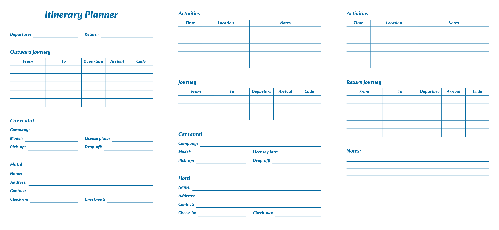

# Itinerary Planner

A simple printable itinerary planner to help organize trips


## Features

- Modular: Add as many destinations as you wish!
- Manage car renting
- Organize activities
- A little note section at the end


## Screenshots




## Usage

Using this is as simple as downloading the PDF from the [release section](https://github.com/Delta1925/itinerary-planner/releases) and printing it!
## Requirements

- [PNPM](https://pnpm.io/)
- [Node.js](https://nodejs.org/)
## Developing

Clone the project

```bash
$  git clone https://github.com/Delta1925/itinerary-planner
```

Go to the project directory

```bash
$  cd itinerary-planner
```

Install dependencies

```bash
$  pnpm install
```

Start the dev server

```bash
$  pnpm run dev
```


## Building

As a website

```bash
$  pnpm run build       # Output: ./dist
```

As a PDF

```bash
$  pnpm run export      # Output: ./dist/export.pdf
```

## Acknowledgements

 - [Material Design Icons](https://github.com/Templarian/MaterialDesign)
 - [Convert Web Pages into PDF with Puppeteer and NodeJS](https://livecodestream.dev/post/convert-web-pages-into-pdfs-with-puppeteer-and-nodejs/)
 

