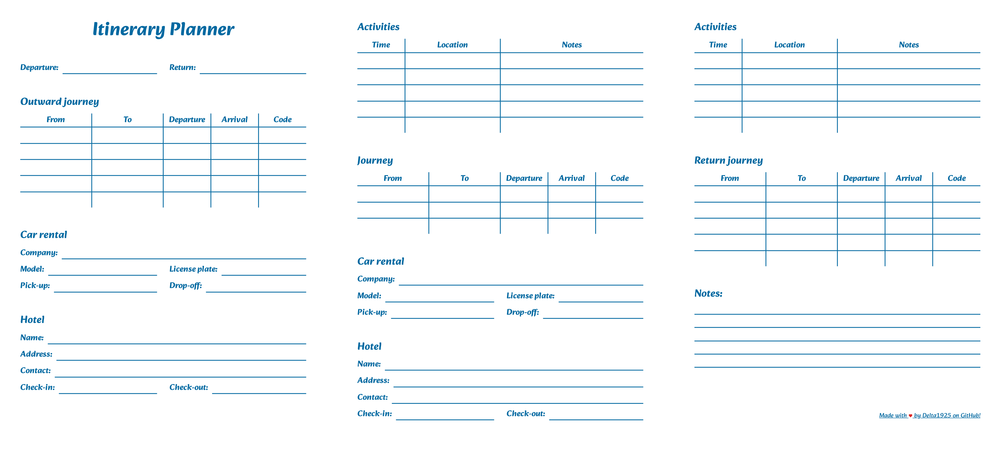

# Itinerary Planner

A simple printable itinerary planner to help organize trips


## Features

- Modular: Add as many destinations as you wish!
- Manage car renting
- Organize activities
- A little note section at the end

## Screenshots



## Usage

To get started, download the PDF from the [release section](https://github.com/Delta1925/itinerary-planner/releases/latest) and print it!  
If you have just one destination (e.g: Home -> Destination -> Home) you should only print the first and last page.  
In order to add a second destination (e.g: Home -> Destination A -> Destination B -> Home), also print the second page.  
For any further destination, print another copy of the second page and place it before the last page.

## Requirements

- [PNPM](https://pnpm.io/)
- [Node.js](https://nodejs.org/)

## Developing

Clone the project

```bash
$  git clone https://github.com/Delta1925/itinerary-planner
```

Go to the project directory

```bash
$  cd itinerary-planner
```

Install dependencies

```bash
$  pnpm install
```

Start the dev server

```bash
$  pnpm run dev
```

## Building

As a website

```bash
$  pnpm run build       # Output: ./dist
```

As a PDF

```bash
$  pnpm run export      # Output: ./dist/export.pdf
```

## Acknowledgements

- [Alkatra font](https://github.com/suman51284/Alkatra)
- [Creating font subsets](https://markoskon.com/creating-font-subsets/)
- [Material Design Icons](https://github.com/Templarian/MaterialDesign)
- [Convert Web Pages into PDF with Puppeteer and NodeJS](https://livecodestream.dev/post/convert-web-pages-into-pdfs-with-puppeteer-and-nodejs/)
- [readme.so](https://readme.so/)
